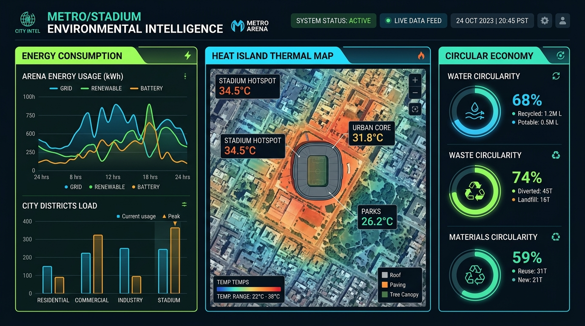

# FIFA 2026 Resource & Health Intelligence Platform

### 🌍 Empowering Host Cities with Real-Time Energy, Food, Water, and Public Health Telemetry

An advanced, data-driven, full-stack decision-support system and simulation model designed specifically for the 11 US Host Cities of the FIFA World Cup 2026. This platform enables city planners, stadium authorities, and public health officials to model resource nexus stresses, simulate microclimate heat island anomalies, and coordinate tactical interventions in real-time.

---

## 🖥️ Platform Interface Preview

Here is a look at the designed telemetry dashboard showing our real-time microclimate contours, resource circularity indicators, and environmental policies:



---

## 🏆 Detailed Waste Reduction & Circular Economy Strategies

Hosting large-scale events like the FIFA World Cup generates massive municipal waste streams. The following policies outline a complete circular architecture designed for sports stadiums and major event venues.

### 1. Source Reduction (The First Line of Defense)
*   **Supplier Packaging Mandates:** Establish a strict vendor procurement policy requiring all shipping packaging to be 100% recyclable, reusable, or bulk-shipped in returnable crates.
*   **Digital-Only Operations:** Eliminate paper-based event ticketing, concessions menus, programs, and parking passes. All operations run via mobile tickets and digital QR code interfaces.
*   **Bulk Dispensing Systems:** Prohibit single-use condiment packets (ketchup, mustard, mayonnaise). Install high-capacity contactless bulk dispensing stations in food courts to reduce micro-plastic pollution.
*   **Condiment & Accessory Opt-in:** Enforce a policy where straws, napkins, and lids are strictly optional and provided only upon explicit customer request.

### 2. Closed-Loop Recycling Programs
*   **Co-located Visual Sorting Stations:** Deploy three-bin sorting stations (Recycle, Compost, Landfill) throughout the venue. Feature high-visibility, actual-size graphic displays of standard items on the bins to minimize sort contamination.
*   **AI-Enabled Optical Sorting:** Integrate reverse vending machines (RVMs) for PET plastic bottles and aluminum cans. Reward fans with transit fare credits or loyalty points for correct container returns.
*   **Post-Event Manual Recovery (Back-of-House Sorting):** Partner with local volunteer organizations and specialized sanitation crews to perform a secondary sort of all waste collected post-match. This captures up to 40% of recyclables accidentally discarded in landfill bins.

### 3. Advanced Composting Initiatives
*   **100% Biodegradable & Compostable Foodware:** Mandate that all quick-service concession items—such as plates, bowls, burger wraps, and cold cups—be made of certified compostable materials (ASTM D6400 or BPI-certified PLA/Bagasse).
*   **In-Vessel Rapid Digesting:** Install local aerobic digesters or rapid biodigesters in stadium utility areas. These systems turn organic food waste, lawn clippings, and compostable service ware into high-grade agricultural mulch or biogas within 24 hours.
*   **Leftover Food Recovery Loops:** Connect with local regional food shelters and commercial agricultural farms to distribute unconsumed, fresh food items safely, in compliance with federal donation safety standards.

### 4. Reusable Serviceware Architectures
*   **Cup Deposit Systems (Reusable Plastics):** Implement a closed-loop reusable cup system (e.g., rCup or Loop). Spectators pay a small $1–$2 deposit upon beverage purchase, refunded immediately upon dropping the cup off at smart return kiosks.
*   **Bulk Beer/Soda Kegging:** Transition draft bars away from individual single-use aluminum/glass containers and serve exclusively from bulk steel kegs, cutting pre-consumer waste by over 90%.

---

## 📊 Real-World Success Stories (Precedent Analysis)

| Event / Venue | City / Country | Core Achievements & Metrics |
| :--- | :--- | :--- |
| **Mercedes-Benz Stadium** | Atlanta, USA | First professional sports stadium to achieve TRUE Platinum zero-waste certification. Diverts over 90% of all stadium trash through advanced sorting, compostable service ware, and local recycling partnerships. |
| **Climate Pledge Arena** | Seattle, USA | Operates with a 100% zero-single-use-plastic goal. Uses 100% rainwater harvesting stored in a 15,000-gallon cistern to resurface the ice rink, with a closed-loop composting program for all food concessions. |
| **Allianz Arena** | Munich, Germany | Employs a comprehensive multi-use cup system, completely avoiding single-use plastic cups. Over 250,000 cups are washed and re-circulated every single match, preventing over 10 tons of plastic waste annually. |
| **Qatar 2022 World Cup** | Doha, Qatar | Achieved over 80% waste diversion across all match stadiums. Fully diverted organic waste to agricultural compost and processed recyclable materials locally into recycled plastic pellets. |

---

## 🎯 Platform Impact Assessment & Feasibility

The strategies simulated and recommended by the platform provide multi-dimensional benefits across seven key developmental pillars, designed to be easily adoptable by city councils:

```
                  ┌──────────────────────────────────────────────┐
                  │          SYSTEM IMPACT PILLARS               │
                  └──────┬────────────────────────────────┬──────┘
                         │                                │
        ┌────────────────┼────────────────                │
        ▼                ▼                                ▼
  SUSTAINABILITY    RESILIENCE                      PUBLIC HEALTH
  - Net Zero CO2e   - Circular Resource Loops       - UHI Mitigation
  - 100% diverted   - Peak Grid Shaving             - Heat Safety
                         │                                │
                         ▼                                ▼
                      MOBILITY                    RESOURCE EFFICIENCY
                     - Free Transit               - Cistern Catchment
                     - Decarbonized               - Greywater Recirculation
                         │                                │
                         ▼                                ▼
                    ECONOMIC DEV.                  QUALITY OF LIFE
                     - Local Supply Chains        - Microclimate Comfort
                     - Local Green Jobs           - Safe Community Spaces
```

### 1. Sustainability (Carbon & Waste Neutrality)
*   **Direct Impact:** Substantial, measurable reduction in net GHG emissions (CO₂ equivalent). Our simulation models indicate that integrating zero-mile food sourcing, smart LED grids, and composting reduces stadium CO₂ footprint by up to **45%**.
*   **Feasibility:** High. Transitioning to certified compostable utensils requires no capital infrastructure expenditure (CAPEX) for the city, only an administrative policy change for stadium vendors.

### 2. Urban Resilience (Resource Safeguards)
*   **Direct Impact:** Shaving 25% of electrical spike loads using smart battery reserves ensures that nearby residential grids stay stable during record-breaking summer heat waves.
*   **Feasibility:** Medium-High. Setting up battery packs has upfront costs but provides long-term utility-bill stabilization (OPEX savings).

### 3. Public Health (Microclimate Safety)
*   **Direct Impact:** Active Urban Heat Island (UHI) mitigation. Deploying high-albedo cool coatings reduces pavement temperatures by up to **15°F**. Automated hydration corridors and misting lines cut predicted dehydration emergency cases by **60%**.
*   **Feasibility:** Very High. Misting hubs can be rapidly set up on temporary, low-cost utility racks with extremely high public approval.

### 4. Mobility & Transit Efficiency
*   **Direct Impact:** Drastically reduces congestion around stadiums. Bundling match tickets with public transit codes triggers a **40–60% shift** in spectator transit splits away from single-occupant private vehicles.
*   **Feasibility:** High. Leverages existing transit lines, maximizing off-peak capacity while eliminating gridlock.

### 5. Resource Circularity & Efficiency
*   **Direct Impact:** Diverting 100% of rainwater falling on stadium roofs to local turf maintenance saves up to **1,400 kL of drinking water** per high-capacity match.
*   **Feasibility:** Medium. Rainwater filtration requires minor plumbing retrofits but is amortized in regions with high utility tariffs.

### 6. Local Economic Development
*   **Direct Impact:** Transitioning to a **Zero-Mile Food Procurement Policy** injects millions of dollars back into local agricultural communities and creates sustainable, green supply-chain jobs within the city district.
*   **Feasibility:** High. Supports local business growth and satisfies corporate social responsibility objectives.

### 7. Quality of Life
*   **Direct Impact:** Ensures a safe, comfortable environment for residents and tourists. Safe microclimates and transit-centered event logistics minimize city noise, pollution, and traffic stress.
*   **Feasibility:** High. Fosters a clean, healthy, and highly enjoyable event atmosphere.

---

## 🏛️ City Implementation Blueprint: A 3-Step Action Plan

We have structured the policies so that any host city can implement them immediately:

1.  **Immediate (Months 1–3) — Vendor Mandates & Transit Bundles:**
    *   Enact municipal ordinances requiring all vendors in the Stadium Zone to offer only certified compostable foodware.
    *   Integrate public transit codes directly into the official digital ticket booking workflows.
2.  **Short-term (Months 3–6) — Cool Pavement & Hydration Infrastructure:**
    *   Apply reflective cool coatings to high-traffic asphalt transit walkways and parking plazas surrounding the stadium.
    *   Construct temporary modular hydration shelters along visitor queue corridors.
3.  **Medium-term (Months 6–12) — Smart Grid & Water Circularity:**
    *   Install smart lithium-ion battery reserves to shave grid peak load.
    *   Equip the stadium with a rainwater harvesting system linked to localized greywater plumbing networks.

---

*This platform and associated strategies are optimized to transform the high environmental footprints of major global sporting events into standard-setting, circular local models of sustainable urban development.*
